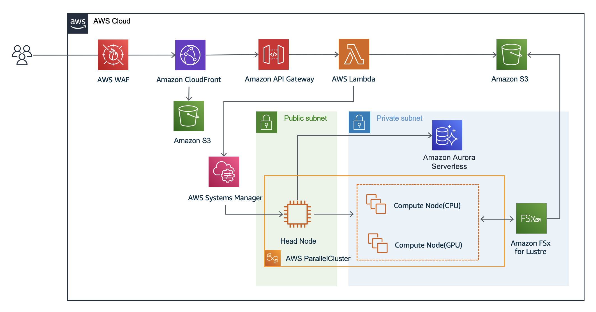

# AlphaFold2 Webapp on AWS

View this page in [Japanese(日本語)](README_ja.md)

AlphaFold2 Webapp on AWS provides a web frontend that allows users to run AlphaFold2 or ColabFold using GUI. In addition, administrators can easily build an AlphaFold2 or ColabFold analysis environment with AWS CDK. For more information, please refer to [an AWS HPC blog post: "Running protein structure prediction at scale using a web interface for researchers"](https://aws.amazon.com/blogs/hpc/running-protein-structure-prediction-at-scale-using-a-web-interface-for-researchers/).




**NOTE**: On the frontend, there are two tabs, AlphaFold2 and ColabFold, each with a corresponding page. However, only one of them will actually work. If the HeadNode specified during frontend setup was AlphaFold2, only the AlphaFold2 page will work, and if it was ColabFold, only the ColabFold page will work.

## Prerequisites for development environment

**NOTE**: We recommend that you follow the steps in the next section to set up your development environment.

- Install [AWS CLI](https://docs.aws.amazon.com/cli/latest/userguide/install-cliv2.html) and [Set configuration and credentials](https://docs.aws.amazon.com/cli/latest/userguide/cli-configure-files.html)
- Install [Python 3](https://www.python.org/about/)
- Install [Node.js LTS](https://nodejs.org/en/)
- Install [Docker Desktop](https://www.docker.com/products/docker-desktop/)

## Set up your development environment using AWS Cloud9

**NOTE**: We recommend you create your AWS Cloud9 environment in `us-east-1` (N. Virginia) region.

**NOTE**: If you are going to create an AWS Cloud9 environment using the following commands, the prerequisites above (e.g. AWS CLI / Python / Node.js / Docker) are pre-configured at Cloud9.

1. Launch [AWS CloudShell](https://docs.aws.amazon.com/cloudshell/latest/userguide/welcome.html) and run the following command.

```sh
git clone https://github.com/aws-samples/cloud9-setup-for-prototyping
cd cloud9-setup-for-prototyping
```

2. To assign an Elastic IP to Cloud9, edit the `params.json` file by `vim params.json` and change the `attach_eip` option to `true`.

```diff
  "volume_size": 128,
- "attach_eip": false
+ "attach_eip": true
}
```

3. Launch Cloud9 environment `cloud9-for-prototyping`

```sh
./bin/bootstrap
```

**NOTE:** After the completion of the bootstrap process, the Elastic IP assigned to Cloud9 will be displayed on the screen. Copy this IP to keep it for future reference.

```
Elastic IP: 127.0.0.1 (example)
```

4. Open the [AWS Cloud9 console](https://console.aws.amazon.com/cloud9/), and open an environment named `cloud9-for-prototyping`.
5. On the menu bar at the top of the AWS Cloud9 IDE, choose `Window` > `New Terminal` or use an existing terminal window.
6. In the terminal window, enter the following.

```sh
git clone https://github.com/aws-samples/alphafold-protein-structure-prediction-with-frontend-app.git
```

1. Go to `alphafold-protein-structure-prediction-with-frontend-app` directory.

```sh
cd alphafold-protein-structure-prediction-with-frontend-app/
```

## Deploy the application

**NOTE**: The following command uses `us-east-1` (N. Virginia) region.

**NOTE**: We recommend that you use the Cloud9 environment for the following steps.

### 1. Backend

- Before deploying backend CDK stack, you need to build frontend CDK stack. In the terminal window of Cloud9 IDE, enter the following.

```sh
## Build the frontend CDK stack
cd app
npm install
npm run build
```

- Modify the value of `c9Eip` in `provisioning/bin/provisioning.ts` to the Elastic IP address assigned to Cloud9 using the above steps.

```diff
-const c9Eip = 'your-cloud9-ip'
+const c9Eip = 'xx.xx.xx.xx'
```

- After the modification, deploy backend CDK stack.

```sh
cd ../provisioning
npm install
npx cdk bootstrap
## Set up the network, database, and storage
npx cdk deploy Alphafold2ServiceStack --require-approval never
cd ../
```

- After finishing the above command, you will see the output like below.
  - If you miss out these outputs, you can check them from the outputs tab of the stack named `AlphaFold2ServiceStack` at [AWS Cloudformation Console](https://us-east-1.console.aws.amazon.com/cloudformation).

```
Output:
Alphafold2ServiceStack.AuroraCredentialSecretArn = arn:aws:secretsmanager:us-east-1:123456789012:secret:AuroraCredentialSecretxxxyyyzzz
Alphafold2ServiceStack.AuroraPasswordArn = arn:aws:secretsmanager:us-east-1:123456789012:secret:AuroraPasswordxxxyyyzzz
Alphafold2ServiceStack.ExportsOutputRefHpcBucketxxxyyyzzz = alphafold2servicestack-hpcbucketxxxyyyzzz
Alphafold2ServiceStack.FsxFileSystemId = fs-xxxyyyzzz
Alphafold2ServiceStack.GetSSHKeyCommand = aws ssm get-parameter --name /ec2/keypair/key-xxxyyyzzz --region us-east-1 --with-decryption --query Parameter.Value --output text > ~/.ssh/keypair-alphafold2.pem
...
```

- From the outputs above, copy the value of Alphafold2ServiceStack.GetSSHKeyCommand `aws ssm get-parameter ...` and enter it to Cloud9 terminal.
  - This command fetches the private key and saves it to Cloud9.

```sh
aws ssm get-parameter --name /ec2/keypair/key-{your key ID} --region us-east-1 --with-decryption --query Parameter.Value --output text > ~/.ssh/keypair-alphafold2.pem
## change the access mode of private key
chmod 600 ~/.ssh/keypair-alphafold2.pem
```

### 2. Set up a cluster managed by AWS ParallelCluster

- Now that the backend has been built, the next step is to create clusters for protein structure prediction.
- In the Cloud9 IDE terminal, enter the following.
- You can modify `config.yml` to change instance type which is appropriate to your workload.

```sh
## Install AWS ParallelCluster CLI
pip3 install aws-parallelcluster==3.7.2 --user
## Set the default region
export AWS_DEFAULT_REGION=us-east-1

## Generate a configuration file for a ParallelCluster cluster
npx ts-node provisioning/hpc/alphafold2/config/generate-template.ts

## Create a ParallelCluster cluster
pcluster create-cluster --cluster-name hpccluster --cluster-configuration provisioning/hpc/alphafold2/config/config.yml
```

<details>
<summary>For ColabFold</summary>
<pre>
npx ts-node provisioning/hpc/colabfold/config/generate-template.ts
</pre>
<pre>
pcluster create-cluster --cluster-name hpccluster --cluster-configuration provisioning/hpc/colabfold/config/config.yml
</pre>
</details>

- You can check the cluster creation status using the following command.

```sh
pcluster list-clusters
```

```json
Output:
{
  "clusters": [
    {
      "clusterName": "hpccluster",
      ## Wait until CREATE_COMPLETE 
      "cloudformationStackStatus": "CREATE_COMPLETE",
...
```

### 3. Web frontend

- Create a web frontend and connect it to the cluster we just created in the previous step.
- In the terminal of Cloud9 IDE, enter the following.

```sh
## Get the instance ID of the cluster's HeadNode
pcluster describe-cluster -n hpccluster | grep -A 5 headNode | grep instanceId
```

```
Output:
"instanceId": "i-{your_headnode_instanceid}",
```

- In `provisioning/bin/provisioning.ts`, modify the value of `ssmInstanceId` to what we have just fetched in the previous step.

```diff
-const ssmInstanceId = 'your-headnode-instanceid'
+const ssmInstanceId = 'i-{your_headnode_instanceid}'
```

- In `provisioning/bin/provisioning.ts`, modify the value of `allowIp4Ranges` to the IP address ranges that are allowed to connect to the frontend.

```diff
-const allowIp4Ranges = ['your-global-ip-v4-cidr']
+const allowIp4Ranges = ['xx.xx.xx.xx/xx']
```

- After the modification, deploy the frontend CDK stack.

```sh
## Deploy the frontend CDK stack
cd ~/environment/alphafold-protein-structure-prediction-with-frontend-app/provisioning
npx cdk deploy FrontendStack --require-approval never
```

- After finishing the command above, you will see the outputs similar to the following.
  - The value of `CloudFrontWebDistributionEndpoint` shows the URL of the frontend environment.
  - If you miss out these outputs, you can check them from the outputs tab of the stack named `FrontendStack` at [AWS Cloudformation Console](https://us-east-1.console.aws.amazon.com/cloudformation).

```
Output:
FrontendStack.ApiGatewayEndpoint = https://xxxyyyzzz.execute-api.us-east-1.amazonaws.com/api
FrontendStack.ApiRestApiEndpointXXYYZZ = https://xxxyyyzzz.execute-api.us-east-1.amazonaws.com/api/
FrontendStack.CloudFrontWebDistributionEndpoint = xxxyyyzzz.cloudfront.net
```

### 4. Launch a HeadNode in your cluster

```sh
## SSH login to ParallelCluster's HeadNode using private key
export AWS_DEFAULT_REGION=us-east-1
pcluster ssh --cluster-name hpccluster -i ~/.ssh/keypair-alphafold2.pem
```

- Once you logged into the headnode of the ParallelCluster cluster, install the AlphaFold2.

```sh
bash /fsx/alphafold2/scripts/bin/app_install.sh
```

- Create a database for AlphaFold2. This process may take about 12 hours to complete. Once you have started the job, it is safe to close the terminal.

```sh
nohup bash /fsx/alphafold2/scripts/bin/setup_database.sh &
```

<details>
<summary>For ColabFold</summary>
<pre>
bash /fsx/colabfold/scripts/bin/app_install.sh
sbatch /fsx/colabfold/scripts/setupDatabase.bth
</pre>
</details>

### 5. Check if the backend works

- If you are logged out of the ParallelCluster's HeadNode, log in again.

```sh
## SSH login to ParallelCluster's HeadNode using private key
export AWS_DEFAULT_REGION=us-east-1
pcluster ssh --cluster-name hpccluster -i ~/.ssh/keypair-alphafold2.pem
```

- Before testing the backend, make sure downloading datasets is completed.

``` sh
tail /fsx/alphafold2/job/log/setup_database.out -n 8
```

```
Output:
Download Results:
gid   |stat|avg speed  |path/URI
======+====+===========+=======================================================
dcfd44|OK  |    66MiB/s|/fsx/alphafold2/database/pdb_seqres/pdb_seqres.txt

Status Legend:
(OK):download completed.
All data downloaded.
```

- Submit jobs from ParallelCluster's HeadNode with the following commands

```sh
## Fetch the FASTA file of your choice (e.g. Q5VSL9)
wget -q -P /fsx/alphafold2/job/input/ https://rest.uniprot.org/uniprotkb/Q5VSL9.fasta

## Start the job using CLI
python3 /fsx/alphafold2/scripts/job_create.py Q5VSL9.fasta
```

<details>
<summary>For ColabFold</summary>
<pre>
wget -q -P /fsx/colabfold/job/input/ https://rest.uniprot.org/uniprotkb/Q5VSL9.fasta
python3 /fsx/colabfold/scripts/job_create.py Q5VSL9.fasta
</pre>
</details>

- Check the job status with the following command.

```sh
squeue
```

```
Output:
## While running a job
             JOBID PARTITION     NAME     USER ST       TIME  NODES NODELIST(REASON)
                 1 queue-cpu setupDat   ubuntu CF       0:03      1 queue-cpu-dy-x2iedn16xlarge-1

## Once all the jobs finished
             JOBID PARTITION     NAME     USER ST       TIME  NODES NODELIST(REASON)
```

### 6. Check if the frontend works

- Access the frontend URL that you obtained in [step 3](#3-web-frontend).
  - If you forgot the URL, you can check it from the value of `CloudFrontWebDistributionEndpoint` at the outputs tab of the stack named `FrontendStack` at [AWS Cloudformation Console](https://us-east-1.console.aws.amazon.com/cloudformation).
  - It looks like `xxxyyyzzz.cloudfront.net`.
- From the frontend, you can submit a job, list recent jobs, cancel a job, and visualize the result of the job.

### 7. Clean up

When you are done trying out this sample, remove the resource to avoid incurring additional costs. Run the following commands from the Cloud9 terminal.

- First, delete your ParallelCluster cluster.

```sh
## Delete the dataset files from HeadNode
export AWS_DEFAULT_REGION=us-east-1
pcluster ssh --cluster-name hpccluster -i ~/.ssh/keypair-alphafold2.pem
rm -fr /fsx/alphafold2/database/
logout

## Delete the cluster
export AWS_DEFAULT_REGION=us-east-1
pcluster delete-cluster -n hpccluster
```

- Delete the CDK stacks.

```sh
## Check the name of the CDK stacks (for frontend and backend) and destroy them
cd ~/environment/alphafold-protein-structure-prediction-with-frontend-app/provisioning
npx cdk list
npx cdk destroy FrontendStack
npx cdk destroy GlobalStack
npx cdk destroy Alphafold2ServiceStack
```

- Lastly, Remove the Cloud9 development environment and Elastic IP attached Cloud9 from the AWS Management Console. 
